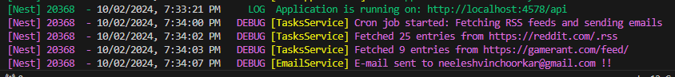

Bhumio-Task:-

- Current Implementation:
  1. Fetched content from RSS feeds and compared it with the existing RSS entries in the database (stored in the RssEntries table).
  2. Filtered out new RSS entries and stored them in the database.
  3. Retrieved all subscribers from the Subscriber table and sent email updates to them with the new content.
  4. Automated the process using a Cron Job, scheduled to run every day at 8 AM, as per the task requirements in the assignment.
  5. Tried to understand the codebase.

- Potential Improvement:
  An alternative approach could involve organizing RSS feeds and subscriber data more efficiently by utilizing the List, Organization, and Campaign entities:
  - The RSS feeds could be stored in the List entity's customFields column for every organization.
  - Organization details and subscribers could be associated via the Organization entity.
  - Each campaign could be named as an "RSS Campaign" in the Campaign entity with List and Organization .
  This structure would improve data organization and make it easier to manage multiple RSS feeds for different organizations in the future.

